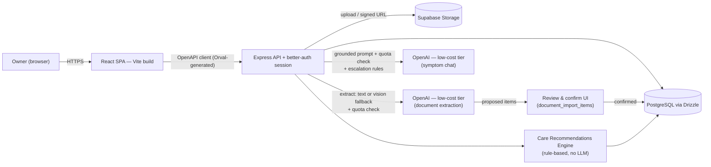

# Pet Health Companion — Product Requirements

**Status:** Draft v1.3 (MVP scope confirmed via stakeholder Q&A)
**Prepared:** 2026-09-06
**Stage:** Phase 0 → 1
**Live version:** https://claude.ai/code/artifact/6e021d93-7e21-4b48-81a4-f36196d44962

An owner-first hub for pet medical history, reminders, and cautious AI-assisted insight — built the way a family keeps a paper vet folder, made searchable, shared, and a little smarter.

> **v1.3 changelog:** Fixed a roadmap inconsistency — Bolt 13 (co-owner invites) had been listed under Phase 2, contradicting the Phase 3 "designed for, not built" status already given to the co-owner persona (section 2) and its P3 tag (section 5). Moved it to Phase 3 to match; no scope change otherwise.
>
> **v1.2 changelog:** Added **Smart Document Upload** — upload a vet visit report and the AI proposes health records, medications, and reminders to add, which the owner reviews and confirms rather than the app writing them automatically. Introduced a two-lane usage quota (one-time onboarding-import allowance + smaller ongoing monthly allowance) so backfilling years of history doesn't compete with steady-state usage. Unit economics were checked (~$0.10–0.15/month even at full quota usage on a low-cost model tier) — the quota is an abuse/storage guardrail, not a margin necessity.
>
> **v1.1 changelog:** MVP scope was walked through question-by-question rather than assumed. Attachments (upload *and* link) and a rule-based care-recommendation engine moved **into** MVP; a symptom log and vet-contact field were added; AI chat usage is quota-governed; monetization/tiering was explicitly pushed **out** of MVP.

## 1. Vision & problem

Pet medical history lives scattered across clinic portals, paper folders, and memory — vaccine dates, med doses, the name of that ointment from two years ago. Owners re-explain history at every visit, miss boosters, and have no way to ask "is this normal for my dog" without a full appointment.

Pet Health Companion is a **MyChart-style patient portal for pets**: one place per household to record what happened, what's due, and what medications are active — plus an AI layer that reads a pet's own record before answering, tells owners what's coming up before they have to think of it, turns a photographed vet report into structured records instead of manual re-typing, and knows when to say "call your vet now" instead of guessing.

**Positioning:** not a clinic system of record and not a diagnostic tool. It is the owner's copy — the thing you'd hand a new vet or a pet-sitter on day one.

## 2. Users & personas

v1 ships for one audience. Two more are designed for, not built, so the data model doesn't have to change shape later.

| Persona | Stage | Needs |
|---|---|---|
| **The owner** | v1 · primary | Manages up to 3 pets. Wants reminders that actually fire, a timeline they can scroll instead of a drawer of paper, and quick reassurance at 11pm without a vet bill. |
| **The co-owner** | Phase 3 · designed for | Partner, roommate, or adult child sharing care of the same pet. Needs their own login against the same pet records — the reason ownership is modeled as a join table, not a column on `pets`. |
| **The clinic** | Phase 3 · designed for | Verified vet staff with read access (and eventually write) to a pet an owner shares with them. Deferred intentionally — trust, verification, and liability are separate problems from the owner product. |

## 3. Scope

**In for v1:**
- Account signup/login (email + password), capped at **3 pets per account**
- Pet profiles, including a free-text primary-vet contact (name, clinic, phone, address)
- Health record timeline with a fixed record-type list, search, and filtering
- Record attachments — **both** upload (PDF/image, 10MB max) and paste-a-link
- Medications with structured frequency (times/day) driving auto-calculated next-dose
- Reminders, both owner-created and system-generated
- **Care Recommendations Engine** — rule-based (not AI), turns vaccine history + pet age into automatic "upcoming care" reminders
- **Smart Document Upload** — upload a vet report, AI proposes health records/medications/reminders, owner reviews and confirms before anything is written
- **Symptom chat** — grounded, single-turn AI Q&A per question, with red-flag escalation and a monthly usage quota
- **Symptom log** — chat can prompt the owner to save a described symptom + the recommendation given
- Responsive web dashboard

**Explicitly out for v1:**
- Clinic/vet accounts and any write access for vets
- Native mobile app; push notifications (dashboard-only, no email/push)
- Household co-ownership invites
- **Any billing, plans, or tiering infrastructure** — "pro-tier" ideas below are feature-deferred, not plan-gated
- Geolocation-based "nearest emergency vet" lookup (needs a maps/places API and *is* one of those deferred pro-tier ideas)
- Auto-applying extracted document data without owner review

## 4. Core user flows

- **Onboarding — sign up → add first pet:** email/password signup → empty-state dashboard prompts "Add a pet" → species, breed, sex, birth date, weight, and (optionally) a primary vet contact captured → dashboard now shows that pet's card. A 4th pet attempt is blocked with a clear cap message.
- **Onboarding — backfill history via Smart Upload:** a new owner with years of past vet paperwork uploads multiple reports for a pet; each is analyzed and queued for review under that pet's one-time 20-document import allowance, so switching from a paper folder (or another app) doesn't mean re-typing years of visits by hand.
- **Daily use — check the dashboard:** owner opens the app and sees, across all their pets: what's due this week (owner reminders + medication doses), plus anything the Care Recommendations Engine has queued (e.g. "Rabies booster likely due — last recorded Mar 2025").
- **Record-keeping — log a vet visit manually:** owner adds a health record: type (from a fixed list), title, date, clinic, summary, and optionally a document — either uploaded (PDF/image) or a pasted link.
- **Record-keeping — log a vet visit via Smart Upload:** owner uploads the visit report instead of typing it in. The AI proposes a health record (and, if applicable, a new medication and/or a follow-up reminder), flags anything that looks like a duplicate of an existing record, and the owner accepts, edits, or dismisses each proposed item before it's saved.
- **Reassurance — symptom chat:** owner picks a pet, describes what they're seeing ("limping after a walk today"). The answer is grounded in that pet's stored records, carries a disclaimer, counts against the account's monthly chat quota, and offers "Add to symptom log" so the description + recommendation get saved to that pet's history. Red-flag language (difficulty breathing, suspected poisoning, collapse, seizure, prolonged bleeding) skips the normal answer entirely, returns an escalation message referencing the pet's saved vet contact when one exists, and is visibly flagged as an escalation in history.

## 5. Functional requirements

Priority: **MVP** ships in Phase 1, **P2** is depth added once MVP is live, **P3** is platform-stage.

| Module | Requirement | Priority |
|---|---|---|
| Accounts | Email/password signup, login, logout, session persistence | MVP |
| Accounts | Password reset via emailed link | P2 |
| Accounts | OAuth (Google) sign-in | P3 |
| Pet profiles | Create/edit/archive a pet: name, species, breed, sex, birth date, weight, photo, notes | MVP |
| Pet profiles | Primary vet contact per pet: name, clinic, phone, address (free text) | MVP |
| Pet profiles | Cap of 3 pets per account, enforced on create with a clear message | MVP |
| Pet profiles | Invite a co-owner to an existing pet | P3 |
| Health timeline | Add/edit/delete records; fixed type list (Exam, Vaccine, Lab, Surgery, Note); filter by type/date; free-text search | MVP |
| Health timeline | Attach a record document — upload (PDF/image, 10MB max) **or** paste a link | MVP |
| Medications | Track name, dose, structured frequency (times/day), active flag, instructions | MVP |
| Medications | Auto-calculate next-dose time from times/day and surface "due soon" on the dashboard | MVP |
| Reminders | Owner-created reminders by category (vaccination, grooming, vet visit, refill); mark complete | MVP |
| Reminders | System-generated reminders from the Care Recommendations Engine, visually distinct from owner-created ones | MVP |
| Reminders | Recurring reminders (e.g. annual boosters auto re-create) | P2 |
| Reminders | Email digest of what's due this week | P2 |
| Care recommendations | Rule-based engine: vaccine-due reminders from vaccine history + interval rules; age-based screening reminders (e.g. senior wellness bloodwork) | MVP |
| Care recommendations | Every system-generated reminder is labeled "general guideline — confirm with your vet" | MVP |
| Smart document upload | Analyze an uploaded vet report and propose health record / medication / reminder entries | MVP |
| Smart document upload | Review screen: accept individually or accept-all; nothing written until confirmed | MVP |
| Smart document upload | Flag proposed items that look like duplicates of existing records; owner decides | MVP |
| Smart document upload | One-time 20-document import allowance per pet (first 30 days) + separate 10/month ongoing allowance | MVP |
| Symptom chat | Free-form question answered against the selected pet's stored records, with disclaimer | MVP |
| Symptom chat | Red-flag detection short-circuits to an escalation message (uses saved vet contact if present), visibly flagged in history | MVP |
| Symptom chat | Monthly usage quota per account (50 questions), cheap-tier model, visible "X of 50 used" indicator | MVP |
| Symptom chat | Geolocation-based nearest emergency vet lookup | P3 (deferred, was called out as "pro-tier") |
| Symptom log | "Add to symptom log" action after a chat answer, saving the description + recommendation to that pet's history | MVP |
| AI insights | Saved chat history per pet, revisitable from the timeline | MVP |
| AI insights | Trend summaries (e.g. weight drift, medication adherence) | P2 |
| Sharing | Read-only share link or invite for a verified clinic account | P3 |
| Export | One-click PDF record summary to bring to a vet visit | P3 |

## 6. Data model

The five original domain tables live in `lib/db/src/schema/care.ts`. MVP scope adds multi-owner accounts, structured medication frequency, attachment metadata, system-vs-owner reminder sourcing, a symptom log, a document-import review pipeline, and usage tracking.

**`users`** *(new)* — `id` serial pk · `email` text unique · `password_hash` text · `display_name` text · `created_at` timestamptz

**`pet_owners`** *(new)* — `user_id` → users.id · `pet_id` → pets.id · `role` owner\|co_owner · `created_at` timestamptz

**`pets`** *(extended)* — `id` serial pk · `name, species, breed, sex` text · `birth_date` text · `weight` / `weight_unit` numeric / lb·kg · `photo_url, notes` text · `vet_name, vet_clinic, vet_phone, vet_address` text, nullable · **`import_docs_used`** integer default 0 *(new)* · **`import_window_ends_at`** timestamptz, set to `created_at + 30 days` *(new — tracks the one-time onboarding-import allowance)*

**`health_records`** *(extended)* — `pet_id` → pets.id · `type` **enum**: exam\|vaccine\|lab\|surgery\|note · `title, date, clinic` text · `summary` text · `document_url` text · `document_type` text: link\|upload · `document_name` text, nullable

**`medications`** *(extended)* — `pet_id` → pets.id · `name, dose` text · `times_per_day` integer · `frequency` text (display label) · `next_dose_at` timestamptz (auto-calculated) · `active` boolean · `instructions` text

**`reminders`** *(extended)* — `pet_id` → pets.id · `title, category` text · `due_date` text · `completed` boolean · `note` text · `source` text: owner\|system · `rule_id` text, nullable

**`insights`** *(extended)* — `pet_id` → pets.id · `title, content` text · `tone, source` text · `disclaimer` text not null · `kind` text: chat\|escalation

**`symptom_logs`** *(new)* — `id` serial pk · `pet_id` → pets.id · `description` text · `logged_at` timestamptz · `insight_id` → insights.id, nullable

**`document_imports`** *(new)* — `id` serial pk · `pet_id` → pets.id · `source_document_url` text · `document_name` text · `lane` text: onboarding\|ongoing · `status` text: pending_review\|reviewed · `analyzed_at` timestamptz

**`document_import_items`** *(new)* — `id` serial pk · `import_id` → document_imports.id · `item_type` text: health_record\|medication\|reminder · `proposed_data` jsonb · `duplicate_of_type` text, nullable · `duplicate_of_id` integer, nullable · `status` text: pending\|accepted\|rejected · `created_record_id` integer, nullable *(set once accepted and written to its target table)*

**`ai_usage_monthly`** *(new)* — `user_id` → users.id · `period_month` text (`"2026-09"`) · `chat_questions_used` integer default 0 · **`document_uploads_used`** integer default 0 *(new — the 10/month ongoing lane; separate from `pets.import_docs_used`, which tracks the one-time onboarding lane)* · `updated_at` timestamptz

## 7. AI features

Three mechanisms are all branded "AI" in the product — worth keeping distinct in the build, since they have different cost profiles and different risk profiles.

### 7a. Care Recommendations Engine (rule-based, no LLM cost)

A small, curated rule set — not a general veterinary knowledge base — runs whenever a pet's records change and writes `reminders` rows with `source = "system"`:

- **Vaccine renewal:** the latest `health_records` row with `type = vaccine` matching a known vaccine name (e.g. rabies, DHPP/DAPP, FVRCP) gets a renewal reminder at a fixed interval (default: 12 months) from its recorded date.
- **Age-based screening:** once a pet crosses a species-appropriate age threshold (e.g. 7 years for dogs, 10 for cats), an annual "senior wellness bloodwork" reminder is created if one doesn't already exist for the current period.

Every rule is intentionally conservative and every reminder it creates carries the label *"general guideline — confirm with your vet"*. `rule_id` prevents the same rule from spawning duplicate reminders on repeated runs. This engine is pure date/age arithmetic — it makes zero calls to the AI provider. It also **re-runs automatically whenever a Smart Document Upload item is confirmed**, so a confirmed vaccine record can immediately queue its own renewal reminder.

### 7b. Smart Document Upload (LLM extraction, review-gated, quota-governed)

- **Pipeline:** an uploaded report (reusing the Bolt 4 storage path) is text-extracted directly if it's a text-based PDF (cheapest path); a scanned/image document falls back to a vision-capable call on the same low-cost model tier. Each document is processed as a single request, capped at the existing 10MB limit plus a page cap (20 pages), to bound cost per analysis regardless of document length.
- **Extraction scope:** the model proposes zero or more items across three types — a health record, a medication, a reminder (e.g. a stated follow-up date) — from one document.
- **Review before write — non-negotiable:** nothing is written to `health_records`, `medications`, or `reminders` until the owner confirms. Proposed items land in `document_import_items` with `status = "pending"`; the owner accepts (individually or all at once), edits, or rejects each one from a review screen before anything becomes a real record. This was a deliberate choice over auto-apply: a misread dose or date is a real-world safety issue, not just a UI bug.
- **Duplicate handling:** if a proposed item resembles an existing record (matched loosely on pet, date proximity, and type/name), it's flagged `duplicate_of_id` and shown as "possible duplicate of [existing record]" rather than silently dropped — the owner decides.
- **Two-lane quota:**
  - **Onboarding import lane** — up to 20 documents per pet, one-time, usable within the pet's first 30 days (`pets.import_docs_used` / `import_window_ends_at`). Exists specifically so an owner backfilling 2–3 years of history from a previous vet or app isn't blocked by a small recurring cap on day one.
  - **Ongoing lane** — 10 documents/account/month after that (`ai_usage_monthly.document_uploads_used`), separate from the chat quota below, since document analysis is a heavier per-call action than a chat question.
  - **Why these numbers are safe:** at low-cost-tier model pricing, a text-based document analysis runs roughly $0.001–0.002, and a vision fallback for a scanned document roughly $0.005–0.01. Maxing out *every* lane in a month (20 onboarding + 10 ongoing + 50 chat questions) costs on the order of **$0.10–0.15/account** — the quota exists to bound abuse and the storage that comes with many uploaded files, not because raw AI spend threatens margins at this model tier.

### 7c. Symptom chat (LLM, quota-governed)

- **Grounding:** the model only ever sees records the server fetched for the selected pet (recent health records, active medications, upcoming reminders) — never arbitrary owner-pasted text standing in for the pet's history.
- **Interaction model:** single-turn for MVP — each question is answered and grounded independently; no multi-turn conversation memory. Keeps the escalation/quota logic simple and auditable.
- **Escalation over guessing:** red-flag symptom language (difficulty breathing, suspected poisoning, collapse, prolonged bleeding, seizure) short-circuits the normal answer path. The response references the pet's saved vet contact if one exists, otherwise general emergency-vet guidance, and is saved with `kind = "escalation"` so it's visibly flagged in history.
- **Symptom log:** a symptom-shaped answer surfaces an "Add to symptom log" action; confirming writes a `symptom_logs` row linked back to the `insights` row via `insight_id`.
- **Cost governance:** 50 questions/account/month (`ai_usage_monthly.chat_questions_used`), served on the same low-cost model tier. The UI shows usage ("32 of 50 used this month") before it's exhausted, and a friendly hard stop after — no overage billing, since no billing infrastructure exists in MVP.
- **Framing:** every response carries the stored `disclaimer` field — educational, not diagnostic — regardless of `kind`.

## 8. Non-functional requirements

- **Security:** session-based auth, hashed passwords, every query scoped to the authenticated owner via `pet_owners` — no pet is reachable by id alone across accounts.
- **Privacy:** pet health data isn't HIPAA-covered, but treated with the same discipline: minimal AI prompt payloads, no third-party training on stored records, a real delete-account path.
- **Reliability:** Drizzle migrations reviewed before `push`, Postgres automated backups, structured request logging already in place via `pino-http`.
- **Performance:** dashboard interactive in under 1s (p50) for an owner with ≤3 pets; chat responses stream rather than block on full generation.
- **Accessibility:** WCAG 2.1 AA; inherited largely for free from Radix primitives already in the component set.
- **Cost control:** Care Recommendations Engine costs nothing per run (pure logic); Smart Document Upload and Symptom Chat costs are bounded by their respective quotas × low-cost model tier × single-call/single-turn design (no compounding context). Combined worst-case is ~$0.10–0.15/account/month at current cheap-tier pricing — verify against live provider pricing before launch, since the conclusion (cents, not dollars) is what should hold, not the exact figure.
- **Observability:** structured logs today; add error tracking (Sentry) and an AI-interaction audit log (every chat call and document analysis, its `kind`/lane, and any escalation or duplicate flag) before Phase 1 ships publicly.

## 9. Stack recommendation

The repo already has a scaffold — the call here is **keep it**, not replace it.

**Backend — keep**
- **Runtime:** Node.js 24 + TypeScript 5.9
- **API:** Express 5 — right-sized for this surface area.
- **Database:** PostgreSQL + Drizzle ORM.
- **Validation:** Zod v4, shared with `drizzle-zod`.
- **API contract:** OpenAPI spec + Orval codegen.
- **AI:** OpenAI SDK (Replit-provisioned) — low-cost model tier for both chat and document extraction; the Care Recommendations Engine calls no AI provider at all.

**Backend — add for MVP**
- **Auth:** better-auth, email + password, Drizzle adapter — Postgres-native and portable off Replit.
- **File storage:** **Supabase Storage** — free tier has no time limit (unlike AWS S3's 12-month free tier), S3-compatible API, simple to wire up for PDF/image uploads with signed URLs.
- **Document parsing:** a PDF text-extraction library (e.g. `pdf-parse`) for the cheap text path, falling back to the vision-capable call on the same OpenAI low-cost tier for scanned/image documents.
- **Rate limiting:** express-rate-limit on the chat and document-analysis routes, layered on top of the monthly quotas to prevent burst abuse within a day.
- **Error tracking:** Sentry.

**Frontend — keep**
- **Framework:** React + Vite + TypeScript — no SSR/SEO need for an authenticated dashboard.
- **Styling/UI:** Tailwind CSS + Radix primitives (shadcn pattern).
- **Server state:** TanStack Query.
- **Forms:** React Hook Form + Zod resolvers.
- **Routing:** wouter.
- **Charts:** Recharts — reserved for Phase 2 trend views.

## 10. Architecture

## 11. Roadmap

**Phase 0 — Foundation** *(done)*
- Workspace scaffold — pnpm monorepo, Express + Vite, Drizzle schema for pets/records/medications/reminders/insights
- UI shell — dashboard, profile, records, medications, reminders, insights pages

**Phase 1 — MVP** *(in scope now — larger than the original draft; attachments, the recommendation engine, and smart document upload all moved in from later phases)*
- Bolt 1 — Accounts & auth: `users`, `pet_owners`, session middleware, protected routes
- Bolt 2 — Pet profiles scoped to owner: CRUD, vet contact fields, 3-pet cap
- Bolt 3 — Health timeline: fixed record types, search + filter by type/date
- Bolt 4 — File uploads: Supabase Storage wiring, upload-or-link on `health_records`, 10MB PDF/image validation
- Bolt 5 — Medications & reminders: structured `times_per_day`, auto next-dose calc, owner-created reminders, dashboard due-soon surfacing
- Bolt 6 — Care Recommendations Engine: vaccine-renewal + age-based screening rules, system-sourced reminders with `rule_id` dedupe
- Bolt 7 — Smart Document Upload: text/vision extraction pipeline, `document_imports`/`document_import_items`, review-and-confirm UI, duplicate flagging, two-lane quota, triggers Bolt 6 on confirm
- Bolt 8 — Symptom chat v1: grounding, escalation with vet-contact reference, visible escalation flag, disclaimer
- Bolt 9 — Symptom log: "add to symptom log" action, `symptom_logs` table, surfaced in pet history
- Bolt 10 — AI usage quotas: `ai_usage_monthly` (chat + ongoing document lane), `pets.import_docs_used` (onboarding lane), low-cost model wiring, usage indicators, hard-stop UX

**Phase 2 — Depth** *(next)*
- Bolt 11 — Email digest + recurring reminders
- Bolt 12 — Trend insights (weight, adherence) with Recharts

**Phase 3 — Platform** *(later)*
- Bolt 13 — Co-owner invites on `pet_owners` — matches the "designed for, not built" status already given to the co-owner persona in section 2 and the P3 tag in section 5; kept here rather than Phase 2 despite the schema already being multi-owner-shaped
- Bolt 14 — Verified clinic accounts, read-only share links
- Bolt 15 — Native mobile / push notifications
- Bolt 16 — One-click PDF record export for vet visits
- Bolt 17 — Geolocation-based nearest emergency vet lookup (the deferred "pro-tier" idea)
- Bolt 18 — Actual plan/billing infrastructure, if a paid tier is pursued at all

## 12. Success metrics

| Metric | Target (90 days post-launch) |
|---|---|
| Owner activation | ≥ 70% of signups add a pet within the first session |
| Timeline usage | Median owner logs ≥ 1 health record within 30 days |
| Reminder reliability | ≥ 95% of due reminders surfaced on the dashboard on their due date |
| Care engine trust | ≥ 80% of system-generated reminders are not dismissed/deleted within a week of appearing |
| Smart upload accuracy | ≥ 60% of proposed extraction items are accepted without edits |
| Smart upload adoption | ≥ 40% of health records created in an owner's first month come via Smart Upload rather than manual entry |
| Chat trust | < 2% of chat answers flagged/reported as unhelpful or wrong by owners |
| Escalation correctness | 100% of red-flag test-suite prompts trigger the emergency-care path, zero false negatives in review |
| Quota calibration | ≤ 5% of active accounts exhaust either the chat or document-upload monthly quota (signal to revisit the defaults) |

## 13. Risks & open questions

- **Risk:** an AI chat answer reads as diagnostic and delays a real vet visit. *Mitigation:* escalation rules + disclaimer are non-negotiable acceptance criteria on Bolt 8, tested with an explicit red-flag prompt suite.
- **Risk:** cross-owner data leakage if a query forgets the `pet_owners` scope check. *Mitigation:* a single shared "assert ownership" middleware used by every pet-scoped route.
- **Risk:** the Care Recommendations Engine's vaccine/screening rules read as more authoritative than intended. *Mitigation:* deliberately small, conservative rule set; every generated reminder carries a "confirm with your vet" label; track the dismissal-rate metric above as an early accuracy signal.
- **Risk:** Smart Document Upload misreads a dose, date, or diagnosis and it ends up in the record. *Mitigation:* review-and-confirm is non-negotiable — nothing is written without owner approval; duplicate flagging surfaces likely re-reads of the same visit rather than silently merging or dropping them.
- **Risk:** uploaded document volume (scanned PDFs/photos, especially during onboarding backfills) grows storage cost faster than token cost. *Mitigation:* the 10MB/20-page caps bound worst case; revisit a retention/compression policy if Supabase's free storage tier becomes a real constraint.
- **Risk:** chat or document-analysis cost exceeds expectations even under quota. *Mitigation:* low-cost model tier + single-call/single-turn design (no compounding context) + per-day rate limiting layered under the monthly caps; current unit-cost estimate is ~$0.10–0.15/account/month at full usage across both features (verify against live pricing before launch).
- **Open question:** exact vaccine-interval defaults per species/vaccine for the recommendation engine — needs a short reference list before Bolt 6.
- **Open question:** email provider for Phase 2 digests — decide alongside Bolt 11.

## 14. How we'll build it — AI-DLC

This document is the **Inception** artifact — and unlike the first draft, its MVP scope was built by asking, not assuming. From here, work moves in **Construction bolts** — the vertically-sliced units in the roadmap above — each one taken from spec to typechecked, tested code before the next starts.

- **Inception** — this PRD. Scope, data model, and acceptance criteria agreed before code — revisited only when a bolt surfaces something this doc got wrong.
- **Construction** — one bolt at a time. Implement → typecheck across the workspace → exercise the flow → move on. No bolt is "done" while a later one depends on it silently.
- **Operations** — feedback in. Success metrics and the risk log above feed back into re-prioritizing the next bolt, not a separate maintenance phase.
