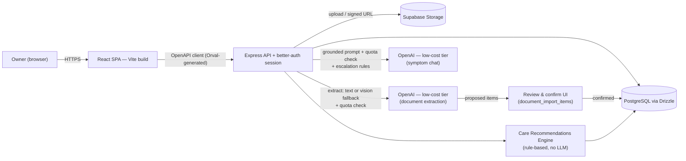

# Pet Health Companion — Product Requirements

**Status:** Draft v1.8 (MVP scope confirmed via stakeholder Q&A)
**Prepared:** 2026-09-06
**Stage:** Phase 1 done; Phase 2 in progress (Bolts 12, 19, 20, 21 shipped; Bolts 22-24 built, awaiting review — PRs #44/#46/#47; Bolt 25 not started; Bolt 11 deprioritized — see §11)
**Live version:** https://claude.ai/code/artifact/6e021d93-7e21-4b48-81a4-f36196d44962

An owner-first hub for pet medical history, reminders, and cautious AI-assisted insight — built the way a family keeps a paper vet folder, made searchable, shared, and a little smarter.

> **v1.8 changelog:** Built the epic this PRD scoped — Bolt 22 (Symptom Journal, PR #44) and Bolts 23/24 (the detection + alert engine, PR #47) — sooner than v1.7's own plan called for. That plan said to wait until Bolt 22 had real owner usage before building detection, since there was no real symptom data yet to validate against. The team decided not to wait: the thresholds below were never something this app needed to learn from its own usage in the first place — they're pulled directly from published veterinary guidance, the same way the Care Recommendations Engine's vaccine rules are sourced from published intervals, not learned from app usage. Real usage is still valuable for *tuning* these thresholds later, but was never a hard prerequisite for shipping a correct first version — so "wait and see" became "ship it, then tune it." One bug caught during testing, before merge: an early version of the engine could let an unrelated logged symptom (e.g. limping) crowd a different pattern's (e.g. low energy) recent-entries window, hiding a real pattern that should have fired — fixed and re-verified. Also corrected §6's `alerts.severity` description, which listed a `green` value that was never actually in the schema (green is the *absence* of an active alert row, not a stored value). Both PRs were tested locally before opening — Bolt 22/23/24's backend via direct API calls, the dashboard banner in-browser. See §7e and §11.
>
> **v1.7 changelog:** Replaced Bolt 23/24's placeholder thresholds ("e.g. 3 of the last 4 entries") with concrete, individually-cited veterinary guidance per signal (energy/appetite, diarrhea, vomiting — same-day vs. recurring cases, limping) and a firm, explicit rule: **the predictive-monitoring engine never attempts a symptom-to-medication or symptom-to-diagnosis correlation** — that requires real judgment, which is Pawlie's job (already built and verified to handle it well, appropriately hedged), not a hardcoded rule table that would need a real per-drug side-effect database this app doesn't have. Every alert now includes an "Ask Pawlie about this" handoff instead. Also added **Bolt 21a** — a small, reuse-only extension letting Pawlie propose adding a confirmed fact to a pet's profile notes (no new table, same review-gated confirm/cancel as every other conversational action) — decided during this same review specifically because "the rule engine should have real medication knowledge" turned out to have a better, already-built answer than encoding it as static rules. Corrected a factual error caught during review: the symptom journal has no one-entry-per-day limit (owners can and do log multiple same-day observations, e.g. each vomiting episode) — confirmed directly against `symptom-entries.ts`, and the vomiting threshold now uses this correctly (a same-day 2+ count is its own, more urgent signal). Bolts 19, 20, 21, and 22 also marked shipped in §11, reflecting merged PRs since v1.6.
>
> **v1.6 changelog:** Scoped **Predictive Health Monitoring** (issue #39) — a structured symptom journal, per-pet trend detection, and severity-tiered alerts, deliberately built as an extension of two patterns already shipped and trusted rather than new machinery: the **Care Recommendations Engine**'s rule-based/no-LLM-cost approach (§7a) and **symptom chat's red-flag escalation** (§7c). Scoped down from the original issue to match what the app can actually do today — no push/email notifications exist yet (yellow tier is a dashboard card), no vet messaging/booking integration exists (red tier is a `tel:` link + a copyable summary), and alert explanations are templated rather than LLM-generated (matches the "never diagnose," zero-cost, fully-auditable bar the Care Recommendations Engine already holds). Four new Bolts (22–25) added to Phase 2 — see §7e and §11. Bolt 23 (trend detection) is explicitly sequenced behind Bolt 22 (the journal) having real usage: there's no structured symptom data in the system today, so a detection engine has nothing real to validate against until owners have actually been logging for a while. Every claim above about what does/doesn't already exist (push infra, email pipeline, tel: links, table shapes) was checked directly against the code, not assumed — in the process, found that Bolt 11/11a's "code-complete pending Resend" status didn't actually check out: no trace of the claimed digest/recurrence code exists anywhere in this repo or on any reachable branch. Corrected Bolt 11's status in §11 accordingly (now "not started," not "blocked on config") and moved it behind Bolts 22–25 per team direction. No other change to already-shipped scope.
>
> **v1.5 changelog:** Named and scoped **Pawlie** — the existing Symptom Chat and AI Insights features, unified under one assistant persona with full-context grounding (not just the last 8 records) and, new, the ability to make *confirmed* edits through conversation rather than read-only Q&A only. Extended Smart Document Upload's extraction to also propose weight and breed updates, not just vet contact info. Added three new Bolts (19–21) to Phase 2 — see §7d and §11. No change to already-shipped scope.
>
> **v1.4 changelog:** Fixed two more stale roadmap points: Bolt 12 (trend insights) was still listed under Phase 2 "next" — it's actually built and shipped (weight/adherence trends, `GET /pets/:petId/trends`, the Trends tab in `insights.tsx`); moved it to Phase 1's completed list. Also corrected §9's AI provider — the app calls Anthropic Claude, not OpenAI (the OpenAI integration package is unused dead code, not the live path). No scope change otherwise.
>
> **v1.3 changelog:** Fixed a roadmap inconsistency — Bolt 13 (co-owner invites) had been listed under Phase 2, contradicting the Phase 3 "designed for, not built" status already given to the co-owner persona (section 2) and its P3 tag (section 5). Moved it to Phase 3 to match; no scope change otherwise.
>
> **v1.2 changelog:** Added **Smart Document Upload** — upload a vet visit report and the AI proposes health records, medications, and reminders to add, which the owner reviews and confirms rather than the app writing them automatically. Introduced a two-lane usage quota (one-time onboarding-import allowance + smaller ongoing monthly allowance) so backfilling years of history doesn't compete with steady-state usage. Unit economics were checked (~$0.10–0.15/month even at full quota usage on a low-cost model tier) — the quota is an abuse/storage guardrail, not a margin necessity.
>
> **v1.1 changelog:** MVP scope was walked through question-by-question rather than assumed. Attachments (upload *and* link) and a rule-based care-recommendation engine moved **into** MVP; a symptom log and vet-contact field were added; AI chat usage is quota-governed; monetization/tiering was explicitly pushed **out** of MVP.

## 1. Vision & problem

Pet medical history lives scattered across clinic portals, paper folders, and memory — vaccine dates, med doses, the name of that ointment from two years ago. Owners re-explain history at every visit, miss boosters, and have no way to ask "is this normal for my dog" without a full appointment.

Pet Health Companion is a **MyChart-style patient portal for pets**: one place per household to record what happened, what's due, and what medications are active — plus an AI layer that reads a pet's own record before answering, tells owners what's coming up before they have to think of it, turns a photographed vet report into structured records instead of manual re-typing, and knows when to say "call your vet now" instead of guessing.

**Positioning:** not a clinic system of record and not a diagnostic tool. It is the owner's copy — the thing you'd hand a new vet or a pet-sitter on day one.

## 2. Users & personas

v1 ships for one audience. Two more are designed for, not built, so the data model doesn't have to change shape later.

| Persona | Stage | Needs |
|---|---|---|
| **The owner** | v1 · primary | Manages up to 3 pets. Wants reminders that actually fire, a timeline they can scroll instead of a drawer of paper, and quick reassurance at 11pm without a vet bill. |
| **The co-owner** | Phase 3 · designed for | Partner, roommate, or adult child sharing care of the same pet. Needs their own login against the same pet records — the reason ownership is modeled as a join table, not a column on `pets`. |
| **The clinic** | Phase 3 · designed for | Verified vet staff with read access (and eventually write) to a pet an owner shares with them. Deferred intentionally — trust, verification, and liability are separate problems from the owner product. |

## 3. Scope

**In for v1:**
- Account signup/login (email + password), capped at **3 pets per account**
- Pet profiles, including a free-text primary-vet contact (name, clinic, phone, address)
- Health record timeline with a fixed record-type list, search, and filtering
- Record attachments — **both** upload (PDF/image, 10MB max) and paste-a-link
- Medications with structured frequency (times/day) driving auto-calculated next-dose
- Reminders, both owner-created and system-generated
- **Care Recommendations Engine** — rule-based (not AI), turns vaccine history + pet age into automatic "upcoming care" reminders
- **Smart Document Upload** — upload a vet report, AI proposes health records/medications/reminders, owner reviews and confirms before anything is written
- **Symptom chat** — grounded, single-turn AI Q&A per question, with red-flag escalation and a monthly usage quota
- **Symptom log** — chat can prompt the owner to save a described symptom + the recommendation given
- Responsive web dashboard

**Explicitly out for v1:**
- Clinic/vet accounts and any write access for vets
- Native mobile app; push notifications (dashboard-only, no email/push)
- Household co-ownership invites
- **Any billing, plans, or tiering infrastructure** — "pro-tier" ideas below are feature-deferred, not plan-gated
- Geolocation-based "nearest emergency vet" lookup (needs a maps/places API and *is* one of those deferred pro-tier ideas)
- Auto-applying extracted document data without owner review

## 4. Core user flows

- **Onboarding — sign up → add first pet:** email/password signup → empty-state dashboard prompts "Add a pet" → species, breed, sex, birth date, weight, and (optionally) a primary vet contact captured → dashboard now shows that pet's card. A 4th pet attempt is blocked with a clear cap message.
- **Onboarding — backfill history via Smart Upload:** a new owner with years of past vet paperwork uploads multiple reports for a pet; each is analyzed and queued for review under that pet's one-time 20-document import allowance, so switching from a paper folder (or another app) doesn't mean re-typing years of visits by hand.
- **Daily use — check the dashboard:** owner opens the app and sees, across all their pets: what's due this week (owner reminders + medication doses), plus anything the Care Recommendations Engine has queued (e.g. "Rabies booster likely due — last recorded Mar 2025").
- **Record-keeping — log a vet visit manually:** owner adds a health record: type (from a fixed list), title, date, clinic, summary, and optionally a document — either uploaded (PDF/image) or a pasted link.
- **Record-keeping — log a vet visit via Smart Upload:** owner uploads the visit report instead of typing it in. The AI proposes a health record (and, if applicable, a new medication and/or a follow-up reminder), flags anything that looks like a duplicate of an existing record, and the owner accepts, edits, or dismisses each proposed item before it's saved.
- **Reassurance — symptom chat:** owner picks a pet, describes what they're seeing ("limping after a walk today"). The answer is grounded in that pet's stored records, carries a disclaimer, counts against the account's monthly chat quota, and offers "Add to symptom log" so the description + recommendation get saved to that pet's history. Red-flag language (difficulty breathing, suspected poisoning, collapse, seizure, prolonged bleeding) skips the normal answer entirely, returns an escalation message referencing the pet's saved vet contact when one exists, and is visibly flagged as an escalation in history.

## 5. Functional requirements

Priority: **MVP** ships in Phase 1, **P2** is depth added once MVP is live, **P3** is platform-stage.

| Module | Requirement | Priority |
|---|---|---|
| Accounts | Email/password signup, login, logout, session persistence | MVP |
| Accounts | Password reset via emailed link | P2 |
| Accounts | OAuth (Google) sign-in | P3 |
| Pet profiles | Create/edit/archive a pet: name, species, breed, sex, birth date, weight, photo, notes | MVP |
| Pet profiles | Primary vet contact per pet: name, clinic, phone, address (free text) | MVP |
| Pet profiles | Cap of 3 pets per account, enforced on create with a clear message | MVP |
| Pet profiles | Invite a co-owner to an existing pet | P3 |
| Health timeline | Add/edit/delete records; fixed type list (Exam, Vaccine, Lab, Surgery, Note); filter by type/date; free-text search | MVP |
| Health timeline | Attach a record document — upload (PDF/image, 10MB max) **or** paste a link | MVP |
| Medications | Track name, dose, structured frequency (times/day), active flag, instructions | MVP |
| Medications | Auto-calculate next-dose time from times/day and surface "due soon" on the dashboard | MVP |
| Reminders | Owner-created reminders by category (vaccination, grooming, vet visit, refill); mark complete | MVP |
| Reminders | System-generated reminders from the Care Recommendations Engine, visually distinct from owner-created ones | MVP |
| Reminders | Recurring reminders (e.g. annual boosters auto re-create) | P2 |
| Reminders | Email digest of what's due this week | P2 |
| Care recommendations | Rule-based engine: vaccine-due reminders from vaccine history + interval rules; age-based screening reminders (e.g. senior wellness bloodwork) | MVP |
| Care recommendations | Every system-generated reminder is labeled "general guideline — confirm with your vet" | MVP |
| Smart document upload | Analyze an uploaded vet report and propose health record / medication / reminder entries | MVP |
| Smart document upload | Review screen: accept individually or accept-all; nothing written until confirmed | MVP |
| Smart document upload | Flag proposed items that look like duplicates of existing records; owner decides | MVP |
| Smart document upload | One-time 20-document import allowance per pet (first 30 days) + separate 10/month ongoing allowance | MVP |
| Smart document upload | Propose weight and breed updates when a document states a value differing from the pet's profile, alongside the existing vet-contact-info proposal — same review-gated accept flow | P2 |
| Symptom chat | Free-form question answered against the selected pet's stored records, with disclaimer | MVP |
| Symptom chat | Red-flag detection short-circuits to an escalation message (uses saved vet contact if present), visibly flagged in history | MVP |
| Symptom chat | Monthly usage quota per account (50 questions), cheap-tier model, visible "X of 50 used" indicator | MVP |
| Symptom chat | Geolocation-based nearest emergency vet lookup | P3 (deferred, was called out as "pro-tier") |
| Symptom log | "Add to symptom log" action after a chat answer, saving the description + recommendation to that pet's history | MVP |
| AI insights | Saved chat history per pet, revisitable from the timeline | MVP |
| AI insights | Trend summaries (e.g. weight drift, medication adherence) | P2 |
| Pawlie | Rebrand Symptom Chat + AI Insights as one assistant persona; expand grounding to full record history, symptom logs, trends, and pending Smart Upload items | P2 |
| Pawlie | Answer general factual questions about a pet's own record, not only symptom-shaped ones | P2 |
| Pawlie | Propose a structured edit (profile field, reminder, etc.) from a chat request; owner must explicitly confirm before anything is written | P2 |
| Predictive monitoring | Structured symptom journal — appetite, energy, stool quality, vomiting, limping, behavior, timestamped and tied to a pet | P2 |
| Predictive monitoring | Trend detection: rule-based comparison of new entries against that pet's own recent entries (not a breed baseline), confidence-weighted by how many consistent entries support it | P2 |
| Predictive monitoring | Multi-signal severity scoring combining current symptom entries with existing health records, active medications, and past lab results | P2 |
| Predictive monitoring | Green / yellow / red severity tiers; yellow surfaces as a dashboard card, red adds a "call your vet" (`tel:`) action plus a copyable summary | P2 |
| Predictive monitoring | Every alert shows a templated (non-LLM) reasoning trail — which signals, which historical data points, no black-box output | P2 |
| Predictive monitoring | Lightweight outcome logging — an owner can mark an alert resolved/dismissed with an optional one-field outcome note | P2 |
| Sharing | Read-only share link or invite for a verified clinic account | P3 |
| Export | One-click PDF record summary to bring to a vet visit | P3 |

## 6. Data model

The five original domain tables live in `lib/db/src/schema/care.ts`. MVP scope adds multi-owner accounts, structured medication frequency, attachment metadata, system-vs-owner reminder sourcing, a symptom log, a document-import review pipeline, and usage tracking.

**`users`** *(new)* — `id` serial pk · `email` text unique · `password_hash` text · `display_name` text · `created_at` timestamptz

**`pet_owners`** *(new)* — `user_id` → users.id · `pet_id` → pets.id · `role` owner\|co_owner · `created_at` timestamptz

**`pets`** *(extended)* — `id` serial pk · `name, species, breed, sex` text · `birth_date` text · `weight` / `weight_unit` numeric / lb·kg · `photo_url, notes` text · `vet_name, vet_clinic, vet_phone, vet_address` text, nullable · **`import_docs_used`** integer default 0 *(new)* · **`import_window_ends_at`** timestamptz, set to `created_at + 30 days` *(new — tracks the one-time onboarding-import allowance)*

**`health_records`** *(extended)* — `pet_id` → pets.id · `type` **enum**: exam\|vaccine\|lab\|surgery\|note · `title, date, clinic` text · `summary` text · `document_url` text · `document_type` text: link\|upload · `document_name` text, nullable

**`medications`** *(extended)* — `pet_id` → pets.id · `name, dose` text · `times_per_day` integer · `frequency` text (display label) · `next_dose_at` timestamptz (auto-calculated) · `active` boolean · `instructions` text

**`reminders`** *(extended)* — `pet_id` → pets.id · `title, category` text · `due_date` text · `completed` boolean · `note` text · `source` text: owner\|system · `rule_id` text, nullable

**`insights`** *(extended)* — `pet_id` → pets.id · `title, content` text · `tone, source` text · `disclaimer` text not null · `kind` text: chat\|escalation

**`symptom_logs`** *(new)* — `id` serial pk · `pet_id` → pets.id · `description` text · `logged_at` timestamptz · `insight_id` → insights.id, nullable

**`document_imports`** *(new)* — `id` serial pk · `pet_id` → pets.id · `source_document_url` text · `document_name` text · `lane` text: onboarding\|ongoing · `status` text: pending_review\|reviewed · `analyzed_at` timestamptz

**`document_import_items`** *(new)* — `id` serial pk · `import_id` → document_imports.id · `item_type` text: health_record\|medication\|reminder · `proposed_data` jsonb · `duplicate_of_type` text, nullable · `duplicate_of_id` integer, nullable · `status` text: pending\|accepted\|rejected · `created_record_id` integer, nullable *(set once accepted and written to its target table)*

**`ai_usage_monthly`** *(new)* — `user_id` → users.id · `period_month` text (`"2026-09"`) · `chat_questions_used` integer default 0 · **`document_uploads_used`** integer default 0 *(new — the 10/month ongoing lane; separate from `pets.import_docs_used`, which tracks the one-time onboarding lane)* · `updated_at` timestamptz

**`ai_actions`** *(new, Bolt 21)* — `id` serial pk · `pet_id` → pets.id · `insight_id` → insights.id, nullable *(the Pawlie chat turn that proposed this)* · `action_type` text (e.g. `update_pet_field`, `create_reminder`, `log_symptom`) · `proposed_data` jsonb · `status` text: pending\|confirmed\|cancelled · `applied_at` timestamptz, nullable · `created_at` timestamptz — deliberately parallel to `document_import_items`: same review-gated shape, same non-negotiable "nothing written until confirmed" principle, just sourced from a chat turn instead of a document.

**`symptom_entries`** *(new, Bolt 22)* — `id` serial pk · `pet_id` → pets.id · `logged_at` timestamptz · `appetite` enum: low\|normal\|high, nullable · `energy` enum: low\|normal\|high, nullable · `stool_quality` enum: normal\|soft\|diarrhea\|constipated, nullable · `vomiting` boolean, nullable · `limping` boolean, nullable · `behavior_note` text, nullable · `note` text, nullable — every field nullable since an owner logs whatever they actually observed, not a mandatory checklist. Deliberately separate from the existing `symptom_logs` (a chat-derived free-text note tied to an `insights` row) rather than merged into it — different shape, different source, and keeping them apart means this bolt can't regress the already-shipped symptom-chat flow. A logged weight observation writes to the existing `weight_logs` table (already trend-charted in Bolt 12) instead of duplicating a weight column here.

**`alerts`** *(new, Bolt 23/24)* — `id` serial pk · `pet_id` → pets.id · `triggered_by_entry_id` → symptom_entries.id · `severity` text: yellow\|red *(no stored `green` — green is just the absence of an active row for that pet, not a value)* · `confidence` text: low\|medium\|high *(derived from how many of the last N entries support the flagged pattern — see §7e)* · `reasoning` jsonb *(structured list of `{signal, value, historicalDataPoint, weight}` — the source data a template renders into the shown explanation, never freeform AI text)* · `status` text: active\|dismissed\|resolved · `outcome_note` text, nullable *(Bolt 25 — set when an owner resolves/dismisses with an optional note)* · `created_at` / `resolved_at` timestamptz.

## 7. AI features

Three mechanisms are all branded "AI" in the product — worth keeping distinct in the build, since they have different cost profiles and different risk profiles.

### 7a. Care Recommendations Engine (rule-based, no LLM cost)

A small, curated rule set — not a general veterinary knowledge base — runs whenever a pet's records change and writes `reminders` rows with `source = "system"`:

- **Vaccine renewal:** the latest `health_records` row with `type = vaccine` matching a known vaccine name (e.g. rabies, DHPP/DAPP, FVRCP) gets a renewal reminder at a fixed interval (default: 12 months) from its recorded date.
- **Age-based screening:** once a pet crosses a species-appropriate age threshold (e.g. 7 years for dogs, 10 for cats), an annual "senior wellness bloodwork" reminder is created if one doesn't already exist for the current period.

Every rule is intentionally conservative and every reminder it creates carries the label *"general guideline — confirm with your vet"*. `rule_id` prevents the same rule from spawning duplicate reminders on repeated runs. This engine is pure date/age arithmetic — it makes zero calls to the AI provider. It also **re-runs automatically whenever a Smart Document Upload item is confirmed**, so a confirmed vaccine record can immediately queue its own renewal reminder.

### 7b. Smart Document Upload (LLM extraction, review-gated, quota-governed)

- **Pipeline:** an uploaded report (reusing the Bolt 4 storage path) is text-extracted directly if it's a text-based PDF (cheapest path); a scanned/image document falls back to a vision-capable call on the same low-cost model tier. Each document is processed as a single request, capped at the existing 10MB limit plus a page cap (20 pages), to bound cost per analysis regardless of document length.
- **Extraction scope:** the model proposes zero or more items across three types — a health record, a medication, a reminder (e.g. a stated follow-up date) — from one document.
- **Review before write — non-negotiable:** nothing is written to `health_records`, `medications`, or `reminders` until the owner confirms. Proposed items land in `document_import_items` with `status = "pending"`; the owner accepts (individually or all at once), edits, or rejects each one from a review screen before anything becomes a real record. This was a deliberate choice over auto-apply: a misread dose or date is a real-world safety issue, not just a UI bug.
- **Duplicate handling:** if a proposed item resembles an existing record (matched loosely on pet, date proximity, and type/name), it's flagged `duplicate_of_id` and shown as "possible duplicate of [existing record]" rather than silently dropped — the owner decides.
- **Two-lane quota:**
  - **Onboarding import lane** — up to 20 documents per pet, one-time, usable within the pet's first 30 days (`pets.import_docs_used` / `import_window_ends_at`). Exists specifically so an owner backfilling 2–3 years of history from a previous vet or app isn't blocked by a small recurring cap on day one.
  - **Ongoing lane** — 10 documents/account/month after that (`ai_usage_monthly.document_uploads_used`), separate from the chat quota below, since document analysis is a heavier per-call action than a chat question.
  - **Why these numbers are safe:** at low-cost-tier model pricing, a text-based document analysis runs roughly $0.001–0.002, and a vision fallback for a scanned document roughly $0.005–0.01. Maxing out *every* lane in a month (20 onboarding + 10 ongoing + 50 chat questions) costs on the order of **$0.10–0.15/account** — the quota exists to bound abuse and the storage that comes with many uploaded files, not because raw AI spend threatens margins at this model tier.

### 7c. Symptom chat (LLM, quota-governed)

- **Grounding:** the model only ever sees records the server fetched for the selected pet (recent health records, active medications, upcoming reminders) — never arbitrary owner-pasted text standing in for the pet's history.
- **Interaction model:** single-turn for MVP — each question is answered and grounded independently; no multi-turn conversation memory. Keeps the escalation/quota logic simple and auditable.
- **Escalation over guessing:** red-flag symptom language (difficulty breathing, suspected poisoning, collapse, prolonged bleeding, seizure) short-circuits the normal answer path. The response references the pet's saved vet contact if one exists, otherwise general emergency-vet guidance, and is saved with `kind = "escalation"` so it's visibly flagged in history.
- **Symptom log:** a symptom-shaped answer surfaces an "Add to symptom log" action; confirming writes a `symptom_logs` row linked back to the `insights` row via `insight_id`.
- **Cost governance:** 50 questions/account/month (`ai_usage_monthly.chat_questions_used`), served on the same low-cost model tier. The UI shows usage ("32 of 50 used this month") before it's exhausted, and a friendly hard stop after — no overage billing, since no billing infrastructure exists in MVP.
- **Framing:** every response carries the stored `disclaimer` field — educational, not diagnostic — regardless of `kind`.

### 7d. Pawlie — unified assistant & conversational actions

**What changes vs. today:** Symptom Chat (§7c) and AI Insights are two names for pieces of the same underlying capability — one AI surface, grounded per-pet, with a disclaimer and a quota. Pawlie is that surface, named and given a consistent voice, with two concrete expansions beyond what's built:

1. **Full-context grounding, not a partial slice.** Today's chat only sees the pet's last 8 health records, active medications, and open (incomplete) reminders (`POST /insights` in `care.ts`) — it has no visibility into the pet's symptom-log history, weight/adherence trends (Bolt 12), pending Smart Upload items, or its own past chat history for that pet. Pawlie's grounding payload expands to reasonably cover all of it, so "what's Milo's weight trend been?" or "did we ever log him limping before?" can be answered directly instead of "I don't have that information."
2. **General questions, not only symptom-shaped ones.** The current system prompt is scoped to symptom guidance ("Give concise... guidance grounded only in the supplied profile and records"). Pawlie answers plain factual questions about the pet's own record too ("when was his last rabies shot", "what's his current med schedule") using the same grounded data, while keeping the existing red-flag escalation and disclaimer behavior for anything symptom-shaped.
3. **Conversational actions — new capability.** An owner can ask Pawlie to make a change ("update Milo's weight to 32 lbs", "add a reminder for his grooming appointment next Friday") instead of navigating to the relevant form. Per the same non-negotiable principle already established for Smart Document Upload (§7b) — **nothing is written until the owner confirms.** Pawlie proposes a structured action (which record, which fields, old value → new value) as a card in the chat thread; the owner taps *Confirm* or *Cancel*, exactly like accepting/rejecting a Smart Upload item. No silent writes, ever, regardless of how the request was phrased.

**How proposed actions work:** Claude's tool-use (function-calling) maps the owner's request to one of a small, fixed set of tool schemas — one per mutation the app already exposes (update pet profile field, create/complete a reminder, log a symptom, etc.). The model never executes anything directly; it returns a proposed call, the server validates it against the same Zod schemas every other route already uses, and stores it as a new `ai_actions` row (`status: pending`) exactly parallel to `document_import_items`. Confirming applies it through the existing mutation function for that resource (e.g. the same `updatePetVetInfo`/`insertReminderForPet` helpers Smart Upload already calls) — Pawlie never gets a separate, parallel write path. Every action (proposed, confirmed, cancelled, and what it changed) is retained as an audit trail.

**Cost & scope note:** wider grounding context means larger prompts than today's chat calls — re-check unit economics against the existing ~$0.10–0.15/account/month estimate (§7b, §8) once real payload sizes are measured; if it grows meaningfully, consider capping "full context" to a bounded recent window (e.g. last N of each type) rather than truly everything, and revisit before removing the chat quota's headroom.

**Confirmed memory (Bolt 21a) — Pawlie gets smarter over time, without ever writing something unverified.** Claude itself isn't retrained by this app's usage — "getting smarter" here means the app remembers what was actually confirmed and feeds it back as grounding next time, the same way the last 5 chat turns already are. The reliability line is strict: **only an owner-confirmed fact gets persisted, never Pawlie's own inference or guess treated as settled.** No new table or action type — this reuses the existing `update_pet_profile` tool exactly as built, just with `pets.notes` added to the set of fields it can propose changing. Pawlie can say "should I make a note that he's sensitive to Amoxicillin?" mid-conversation; nothing is written until the owner taps Confirm on that action card, identical to every other conversational action. Fully visible and editable afterward from the pet's own profile page — no separate "AI memory" surface to manage, and no discrete history of *why* a note was added, which is an acceptable trade for v1 given `notes` is already a single free-text field the owner already owns and can correct at any time.

### 7e. Predictive Health Monitoring (rule-based, no LLM cost)

**What this is:** a second, smarter layer on top of the existing date-based reminder system — alerts that fire because a pet's *own* logged symptoms and history suggest a problem, not because a calendar date hit. Sourced from GitHub issue #39, scoped down here to what the app's existing architecture can actually support today.

**Deliberately built as an extension of two things already shipped, not new machinery:**
1. **The Care Recommendations Engine's approach (§7a)** — pure rule-based logic, zero AI-provider calls, runs synchronously right after the mutation that could change its inputs (here: a new `symptom_entries` row), same as the engine already does after a health-record change. Alert reasoning is a structured `{signal, value, historicalDataPoint, weight}` list rendered through a fixed template, **never LLM-generated text** — a template can't hallucinate a data point that isn't there, which is a better fit for "never diagnose" and "no black-box output" than a Claude call would be, and it keeps this feature's marginal cost at the Care Recommendations Engine's existing $0.
2. **Symptom chat's red-flag escalation (§7c)** — already a working, if narrower, prototype of "tiered severity + a reference to the pet's saved vet contact." Bolt 24 extends this pattern (deterministic rule → tier → vet-contact reference) rather than inventing a parallel one.

**Scoped down from the original ask, to match what exists:**
- **Yellow tier ("watch this") is a dashboard card, not a push/email notification.** Verified directly: there is no push-notification code anywhere in this repo (no service worker, no web-push, no FCM/APNs), and no working email-sending pipeline either — Bolt 11's roadmap entry claimed a "code-complete" digest, but no trace of it (`recurrenceInterval*` columns, `lib/integrations-resend`, a digest route, a Render cron job) actually exists in this codebase or on any reachable branch; that status has been corrected in §11 (Bolt 11 is now "not started," not "blocked on config," and moved behind this epic). Either way, predictive monitoring doesn't depend on Bolt 11: if a real digest pipeline is ever built, yellow alerts riding it is a natural bonus, not a prerequisite.
- **Red tier ("contact your vet soon") is a `tel:` link to the pet's saved vet contact plus a copyable summary paragraph**, not real vet messaging or appointment booking — there's no clinic-facing product in this app at all (verified clinic accounts are explicitly Phase 3, Bolt 14).
- **Confidence weighting is entry-count-based, not calendar-day-based.** Nothing in the app prompts an owner to log daily (and the journal has no per-day limit — an owner logging every time a symptom recurs in one day is expected, not an edge case), so a literal "three consecutive days" check would rarely fire on real, gappy data. Instead: a pattern is flagged when it holds across most of a pet's last few entries within a lookback window, tolerant of gaps — the same ratio doubles as the alert's confidence level.

**The rule engine never guesses — this is non-negotiable, not a style preference.** This is health data an owner is relying on; a wrong or invented correlation is a real safety and trust problem, not a cosmetic one. Two hard limits, decided deliberately after review:
1. **Every threshold below is sourced from real veterinary guidance, not assumed.** See the citations under each signal.
2. **The rule engine never attempts to connect a symptom to a medication, a diagnosis, or anything requiring judgment** — e.g. it will never claim "this vomiting might be a side effect of Amoxicillin." That kind of connection requires real medical knowledge applied to a specific case, which is exactly what Pawlie (§7d) already does well, grounded and appropriately hedged ("could be related to X, worth mentioning to your vet") — verified directly in testing. Building a second, cruder version of that reasoning as hardcoded rules (e.g. a static per-drug side-effect table, for medication names owners type as free text, not real drug IDs) would be a worse, harder-to-maintain, and riskier copy of a capability that already exists. So the rule engine's job stays narrow: detect the pattern, decide severity from the pattern's own timing and combination with other patterns — nothing more. Every alert includes an **"Ask Pawlie about this"** action that hands the flagged pattern straight to a Pawlie conversation for the actual medication/history-aware recommendation.

**Thresholds (Bolt 23), each grounded in published veterinary guidance:**
- **Energy or appetite:** flagged when "low" appears in **3 of the pet's last 4 journal entries, within a 7-day window**. Veterinary guidance is explicit that isolated off-days aren't the concern but a recurring pattern is: *"a couple of off days is generally not a big problem... but recurring episodes of poor appetite... frequently point to a chronic progressive illness"* — [VCA: Anorexia in Dogs](https://vcahospitals.com/know-your-pet/anorexia-in-dogs).
- **Diarrhea:** flagged when logged in **2 of the last 3 entries, within a 5-day window**. Softer stool alone is common and usually transient — not specific enough to responsibly flag without better grounding, so only `stoolQuality: diarrhea` counts here, not `soft`.
- **Vomiting — two separate checks, since the journal supports multiple same-day entries and real guidance treats same-day frequency and recurrence-across-days as two different signals:**
  - **2+ vomiting entries within any single 24-hour window** → flagged directly as the more urgent case. *"Severe vomiting is defined as more than two episodes in a 24-hour period."* — [Merck Veterinary Manual](https://www.merckvetmanual.com/dog-owners/digestive-disorders-of-dogs/vomiting-in-dogs).
  - **Vomiting logged on 2+ separate days within a 7-day window** (not same-day) → flagged as the milder, still-worth-watching case. *"Vomiting even once a week may indicate a disease."* — [VCA: Vomiting in Dogs](https://vcahospitals.com/know-your-pet/vomiting-in-dogs).
- **Limping:** flagged when logged in **2+ entries within a 4-day window** — approximates "persisting more than a day," the standard threshold. *"If lameness persists for more than 24 hours, seek veterinary care... a mild episode that resolves quickly may not need a trip."* — [VCA: Lameness in Dogs](https://vcahospitals.com/know-your-pet/lameness-in-dogs). A genuinely acute case (non-weight-bearing, obvious injury) is an emergency the owner would describe in a Pawlie chat message today, where the existing red-flag escalation (§7c) already handles it immediately — the journal's pattern detection is for the slower, easy-to-miss case, not a replacement for that.

**Severity tiers (Bolt 24):**
- **Yellow ("watch this")** — any single pattern above is flagged, alone.
- **Red ("contact your vet soon")** — either of two well-grounded cases, both about *symptom* combination/severity, never a medication guess:
  1. **2 or more distinct patterns are flagged at the same time** (e.g. the energy pattern and the vomiting pattern both active together) — concurrent symptoms are a recognized, more serious presentation than any one alone: *"dogs presenting with... additional clinical signs... were more likely to be in the 'complicated' group"*, and combinations like lethargy + vomiting are specifically called out as a call-your-vet trigger. — [Merck Veterinary Manual](https://www.merckvetmanual.com/dog-owners/digestive-disorders-of-dogs/vomiting-in-dogs).
  2. **The same-day 2+ vomiting case above, on its own** — already the "severe" threshold per the citation above, so it doesn't need a second pattern to justify red.

**The cold-start problem, and why it turned out not to be a hard blocker:** at the time this epic was scoped, there was zero structured symptom data in this system — the only existing symptom-related table (`symptom_logs`) is a handful of free-text notes an owner chose to save from a one-off chat answer. The original plan was to wait until the journal (Bolt 22) had real owner usage before building detection (Bolt 23), since a pattern-matching engine tuned against nothing would just be guessing. But the thresholds above aren't derived from this app's own usage data at all — they're the cited veterinary guidance itself, the same way the Care Recommendations Engine's vaccine rules are sourced from published intervals rather than learned from app usage. So real usage is still genuinely useful for *tuning* these thresholds later, but was never required to ship a correct first version. Bolts 22-24 were built together as a result — see the v1.8 changelog above.

**Data model:** see `symptom_entries` and `alerts` in §6. `symptom_entries` is kept deliberately separate from the existing `symptom_logs` — different shape (structured fields vs. free text), different source (a dedicated journal vs. a chat-flow side effect) — so this epic can't regress the already-shipped symptom-chat feature. The trend/severity engine reads only `symptom_entries`, plus the same health-records/medications/lab-result data Bolt 19's grounding work will also want; building a shared "pet health context" query is a future consolidation opportunity, not a dependency — this bolt's own query need is much narrower (recent entries + recent records/meds) than Pawlie's "everything" grounding.

## 8. Non-functional requirements

- **Security:** session-based auth, hashed passwords, every query scoped to the authenticated owner via `pet_owners` — no pet is reachable by id alone across accounts.
- **Privacy:** pet health data isn't HIPAA-covered, but treated with the same discipline: minimal AI prompt payloads, no third-party training on stored records, a real delete-account path.
- **Reliability:** Drizzle migrations reviewed before `push`, Postgres automated backups, structured request logging already in place via `pino-http`.
- **Performance:** dashboard interactive in under 1s (p50) for an owner with ≤3 pets; chat responses stream rather than block on full generation.
- **Accessibility:** WCAG 2.1 AA; inherited largely for free from Radix primitives already in the component set.
- **Cost control:** Care Recommendations Engine costs nothing per run (pure logic); Smart Document Upload and Symptom Chat costs are bounded by their respective quotas × low-cost model tier × single-call/single-turn design (no compounding context). Combined worst-case is ~$0.10–0.15/account/month at current cheap-tier pricing — verify against live provider pricing before launch, since the conclusion (cents, not dollars) is what should hold, not the exact figure.
- **Observability:** structured logs today; add error tracking (Sentry) and an AI-interaction audit log (every chat call and document analysis, its `kind`/lane, and any escalation or duplicate flag) before Phase 1 ships publicly.

## 9. Stack recommendation

The repo already has a scaffold — the call here is **keep it**, not replace it.

**Backend — keep**
- **Runtime:** Node.js 24 + TypeScript 5.9
- **API:** Express 5 — right-sized for this surface area.
- **Database:** PostgreSQL + Drizzle ORM.
- **Validation:** Zod v4, shared with `drizzle-zod`.
- **API contract:** OpenAPI spec + Orval codegen.
- **AI:** Anthropic Claude (Haiku tier) — low-cost model tier for both chat and document extraction; the Care Recommendations Engine calls no AI provider at all. (An earlier OpenAI integration package exists in the repo but is unused dead code — see `docs/PROJECT.md` gotchas.)

**Backend — add for MVP**
- **Auth:** better-auth, email + password, Drizzle adapter — Postgres-native and portable off Replit.
- **File storage:** **Supabase Storage** — free tier has no time limit (unlike AWS S3's 12-month free tier), S3-compatible API, simple to wire up for PDF/image uploads with signed URLs.
- **Document parsing:** a PDF text-extraction library (e.g. `pdf-parse`) for the cheap text path, falling back to the vision-capable call on the same OpenAI low-cost tier for scanned/image documents.
- **Rate limiting:** express-rate-limit on the chat and document-analysis routes, layered on top of the monthly quotas to prevent burst abuse within a day.
- **Error tracking:** Sentry.

**Frontend — keep**
- **Framework:** React + Vite + TypeScript — no SSR/SEO need for an authenticated dashboard.
- **Styling/UI:** Tailwind CSS + Radix primitives (shadcn pattern).
- **Server state:** TanStack Query.
- **Forms:** React Hook Form + Zod resolvers.
- **Routing:** wouter.
- **Charts:** Recharts — reserved for Phase 2 trend views.

## 10. Architecture

## 11. Roadmap

**Phase 0 — Foundation** *(done)*
- Workspace scaffold — pnpm monorepo, Express + Vite, Drizzle schema for pets/records/medications/reminders/insights
- UI shell — dashboard, profile, records, medications, reminders, insights pages

**Phase 1 — MVP** *(in scope now — larger than the original draft; attachments, the recommendation engine, and smart document upload all moved in from later phases)*
- Bolt 1 — Accounts & auth: `users`, `pet_owners`, session middleware, protected routes
- Bolt 2 — Pet profiles scoped to owner: CRUD, vet contact fields, 3-pet cap
- Bolt 3 — Health timeline: fixed record types, search + filter by type/date
- Bolt 4 — File uploads: Supabase Storage wiring, upload-or-link on `health_records`, 10MB PDF/image validation
- Bolt 5 — Medications & reminders: structured `times_per_day`, auto next-dose calc, owner-created reminders, dashboard due-soon surfacing
- Bolt 6 — Care Recommendations Engine: vaccine-renewal + age-based screening rules, system-sourced reminders with `rule_id` dedupe
- Bolt 7 — Smart Document Upload: text/vision extraction pipeline, `document_imports`/`document_import_items`, review-and-confirm UI, duplicate flagging, two-lane quota, triggers Bolt 6 on confirm
- Bolt 8 — Symptom chat v1: grounding, escalation with vet-contact reference, visible escalation flag, disclaimer
- Bolt 9 — Symptom log: "add to symptom log" action, `symptom_logs` table, surfaced in pet history
- Bolt 10 — AI usage quotas: `ai_usage_monthly` (chat + ongoing document lane), `pets.import_docs_used` (onboarding lane), low-cost model wiring, usage indicators, hard-stop UX
- Bolt 12 — Trend insights (weight, adherence) with Recharts — built out of order, ahead of Bolt 11; `weight_logs`/`medication_dose_logs` tables, `GET /pets/:petId/trends`, Trends tab in `insights.tsx`

**Phase 2 — Depth** *(next)*
- Bolt 19 — Pawlie: rebrand + full-context grounding — rename Symptom Chat/AI Insights to the Pawlie persona in the UI and system prompt; expand the grounding query in `POST /insights` beyond the last 8 records + active meds + open reminders to include symptom-log history, weight/adherence trend data (Bolt 12), pending Smart Upload items, and the pet's own past chat turns; broaden the system prompt to answer general factual questions about the pet, not only symptom-shaped ones. See §7d. **Shipped** (PR #42).
- Bolt 20 — Smart Upload: extend extraction to weight + breed — generalize the existing `buildVetInfoUpdate` (`document-extraction.ts`) into a broader profile-diff proposal covering weight and breed alongside vet contact info; extend the extraction system prompt's schema accordingly. **Depends on fixing the profile-refresh bug first** (see below) — no point proposing more fields the UI still can't reliably reflect once accepted. **Shipped** (PR #33), later also extended to `sex` (PR #35).
- Bolt 21 — Pawlie conversational actions — tool-use (function-calling) mapping a chat request to one of a small fixed set of mutation tool schemas; every proposed action is stored as a new `ai_actions` row (`status: pending`) and requires an explicit owner confirm/cancel before anything is written, applied through the same mutation helpers every other route already uses (never a separate write path). See §7d and the `ai_actions` table in §6. **Shipped** (PR #43).
- Bolt 21a — Pawlie confirmed memory — extend the existing `update_pet_profile` tool to also allow proposing a change to `pets.notes`, so a fact confirmed mid-conversation (a known sensitivity, a vet's remark) actually persists and gets included in future grounding. No new table, no new action type — same review-gated confirm/cancel as every other action. See §7d.
- Bolt 22 — Predictive monitoring: symptom journal — **built, PR #44 open for review.** `symptom_entries` table (appetite/energy/stool/vomiting/limping/behavior, all nullable, weight routed to the existing `weight_logs`), a dedicated logging UI (not just the existing chat-derived "add to symptom log").
- Bolt 23 — Predictive monitoring: baseline & trend detection — **built, part of PR #47 (opened against the Bolt 22 branch, since it depends on `symptom_entries`).** Rule-based, entry-count-windowed comparison against that pet's own recent entries. Concrete, research-cited thresholds per signal (energy/appetite, diarrhea, vomiting — same-day and recurring cases separately, limping) — see §7e. No AI-provider calls, and the engine never attempts a symptom-to-medication or symptom-to-diagnosis correlation — that stays Pawlie's job (see the "Ask Pawlie about this" handoff in §7e and Bolt 24).
- Bolt 24 — Predictive monitoring: severity tiers & alerts — **built, same PR #47, tested locally (API scenarios + in-browser dashboard checks) before opening.** `alerts` table; combines Bolt 23's flagged patterns into yellow/red purely from pattern timing and combination (never a medication guess — see §7e for why that line is firm; no stored `green`, that's just the absence of an active alert); yellow surfaces as a dashboard card, red adds a `tel:`-link-to-saved-vet-contact action plus a copyable summary (extends the existing symptom-chat escalation pattern, §7c); every alert renders its `reasoning` jsonb through a fixed template — no LLM-generated explanation text. Every alert also includes an "Ask Pawlie about this" action, handing the flagged pattern to a Pawlie conversation for the actual medication/history-aware recommendation. See §7e.
- Bolt 25 — Predictive monitoring: outcome logging — **not started.** An owner can already mark an `alerts` row resolved/dismissed (Bolt 24's dismiss action), but there's no UI yet for attaching the optional one-field outcome note (`outcome_note` exists as a schema column, nothing writes to it yet); deliberately lightweight for MVP, sets up (but doesn't require) swapping in a trained model later per the original issue's "leave room for ML" requirement.
- Bolt 11 — Daily email digest + recurring owner reminders — **deprioritized behind Bolts 22–25, and its prior status needs re-checking before it's picked back up.** This roadmap previously described it as "code-complete on `feature/bolt-11-digest-and-recurring-reminders`, pending Resend setup," but that doesn't hold up: no trace of the claimed work (`reminders.recurrenceIntervalValue`/`recurrenceIntervalUnit`, `lib/integrations-resend`, a digest route, a Render cron job) exists anywhere in this repo or on any reachable branch. Treat this as **not started**, not "blocked on config," when it's next prioritized.
- Bolt 11a — Re-scope Bolt 11 from its actual current state, then wire up a real Resend account (API key, verified sending domain or `onboarding@resend.dev` for testing, the three env vars locally and on Render) once there's real code to test against.

> **Bug fixed in passing (2026-09-14):** Smart Upload's "vet contact update" already worked correctly server-side, but the frontend never invalidated the pet-profile/dashboard queries after accepting it — the update was saved but invisible until an unrelated refetch happened to occur. Fixed on `fix/smart-upload-profile-not-refreshing` (PR #31). Called out here since it directly blocks Bolt 20 (more profile fields flowing through the same mechanism) and was found while scoping this epic.
>
> **Bug fixed in passing (2026-09-14):** uploading a vet record whose vaccine history matched a Care Recommendations Engine rule *and* stated its own follow-up date produced two reminders for the same event — the engine's own rule-based guess, and the owner's reminder from the document's stated date. Neither direction checked the other before writing. Fixed on `fix/duplicate-vaccine-reminders` (PR #45): the record's own stated date now always wins, whichever one is created first. Relevant here since it's the same "don't let a guess sit alongside (or ahead of) a real, confirmed fact" principle Bolt 23/24's design leans on above.

**Phase 3 — Platform** *(later)*
- Bolt 13 — Co-owner invites on `pet_owners` — matches the "designed for, not built" status already given to the co-owner persona in section 2 and the P3 tag in section 5; kept here rather than Phase 2 despite the schema already being multi-owner-shaped
- Bolt 14 — Verified clinic accounts, read-only share links
- Bolt 15 — Native mobile / push notifications
- Bolt 16 — One-click PDF record export for vet visits
- Bolt 17 — Geolocation-based nearest emergency vet lookup (the deferred "pro-tier" idea)
- Bolt 18 — Actual plan/billing infrastructure, if a paid tier is pursued at all

## 12. Success metrics

| Metric | Target (90 days post-launch) |
|---|---|
| Owner activation | ≥ 70% of signups add a pet within the first session |
| Timeline usage | Median owner logs ≥ 1 health record within 30 days |
| Reminder reliability | ≥ 95% of due reminders surfaced on the dashboard on their due date |
| Care engine trust | ≥ 80% of system-generated reminders are not dismissed/deleted within a week of appearing |
| Smart upload accuracy | ≥ 60% of proposed extraction items are accepted without edits |
| Smart upload adoption | ≥ 40% of health records created in an owner's first month come via Smart Upload rather than manual entry |
| Chat trust | < 2% of chat answers flagged/reported as unhelpful or wrong by owners |
| Escalation correctness | 100% of red-flag test-suite prompts trigger the emergency-care path, zero false negatives in review |
| Quota calibration | ≤ 5% of active accounts exhaust either the chat or document-upload monthly quota (signal to revisit the defaults) |

## 13. Risks & open questions

- **Risk:** an AI chat answer reads as diagnostic and delays a real vet visit. *Mitigation:* escalation rules + disclaimer are non-negotiable acceptance criteria on Bolt 8, tested with an explicit red-flag prompt suite.
- **Risk:** cross-owner data leakage if a query forgets the `pet_owners` scope check. *Mitigation:* a single shared "assert ownership" middleware used by every pet-scoped route.
- **Risk:** the Care Recommendations Engine's vaccine/screening rules read as more authoritative than intended. *Mitigation:* deliberately small, conservative rule set; every generated reminder carries a "confirm with your vet" label; track the dismissal-rate metric above as an early accuracy signal.
- **Risk:** Smart Document Upload misreads a dose, date, or diagnosis and it ends up in the record. *Mitigation:* review-and-confirm is non-negotiable — nothing is written without owner approval; duplicate flagging surfaces likely re-reads of the same visit rather than silently merging or dropping them.
- **Risk:** uploaded document volume (scanned PDFs/photos, especially during onboarding backfills) grows storage cost faster than token cost. *Mitigation:* the 10MB/20-page caps bound worst case; revisit a retention/compression policy if Supabase's free storage tier becomes a real constraint.
- **Risk:** chat or document-analysis cost exceeds expectations even under quota. *Mitigation:* low-cost model tier + single-call/single-turn design (no compounding context) + per-day rate limiting layered under the monthly caps; current unit-cost estimate is ~$0.10–0.15/account/month at full usage across both features (verify against live pricing before launch).
- **Risk:** Pawlie's conversational actions (Bolt 21) apply an unintended edit because a request was ambiguous or misread. *Mitigation:* review-and-confirm is non-negotiable here too — identical principle to Smart Document Upload; every proposed action shows exactly what field changes from what to what before the owner confirms, and is logged in `ai_actions` regardless of outcome.
- **Risk:** full-context grounding (Bolt 19) meaningfully increases prompt size/cost per chat call. *Mitigation:* re-measure against the existing per-account cost estimate once built; cap to a bounded recent window per data type instead of truly unbounded history if the numbers move materially.
- **Risk:** Bolt 23's thresholds were set from published veterinary guidance, not from this app's own usage — they could still turn out to fire too often (or too rarely) against real owners' sparse, irregular logging habits. *Mitigation:* every threshold has a cited source (§7e), and the engine was tested locally against constructed scenarios covering each pattern individually and in combination before opening PR #47 — but real usage is the only thing that will confirm the thresholds feel right in practice, not just correct on paper. Revisit once there's real usage to look at.
- **Risk:** a predictive alert reads as diagnostic, or the red tier's "contact your vet" action is mistaken for a real booking/messaging integration that doesn't exist. *Mitigation:* same non-diagnostic framing and disclaimer discipline as symptom chat (Bolt 8); red tier is explicitly scoped to a `tel:` link + a copyable summary, not booking, and the UI must not imply otherwise.
- **Open question:** exact vaccine-interval defaults per species/vaccine for the recommendation engine — needs a short reference list before Bolt 6.
- **Open question:** email provider for Phase 2 digests — decide alongside Bolt 11.
- **Open question:** Bolt 23's entry-count/lookback-window thresholds (e.g. "3 of the last 4 entries, 7-day window") are cited from veterinary guidance (§7e), not yet tested against real owner logging patterns — expect to tune once there's real usage.

## 14. How we'll build it — AI-DLC

This document is the **Inception** artifact — and unlike the first draft, its MVP scope was built by asking, not assuming. From here, work moves in **Construction bolts** — the vertically-sliced units in the roadmap above — each one taken from spec to typechecked, tested code before the next starts.

- **Inception** — this PRD. Scope, data model, and acceptance criteria agreed before code — revisited only when a bolt surfaces something this doc got wrong.
- **Construction** — one bolt at a time. Implement → typecheck across the workspace → exercise the flow → move on. No bolt is "done" while a later one depends on it silently.
- **Operations** — feedback in. Success metrics and the risk log above feed back into re-prioritizing the next bolt, not a separate maintenance phase.
